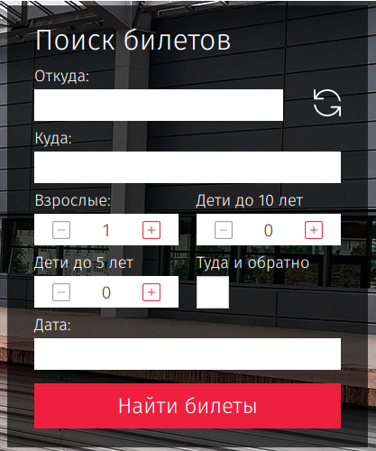

### Trip Calendar (задача со звёздочкой)

#### Легенда

Сервис для путешествий, а именно виджет выбора дат: туда и обратно, если установлена соответствующая галочка.

Аналог - на сайте РЖД и любых авиакомпаний:

#### Описание

Реализованы только переключатель туда-обратно и виджеты ввода дат, выбора их из календаря в соответствии со следующими условиями:

1. Дата «туда» должна быть не раньше, чем сегодняшняя (по времени браузера).
1. Сегодняшняя дата должна быть выделена.
1. Даты до сегодняшней должны быть не активны.
1. Должно быть реализовано переключение месяца — без анимации, просто пересчёт дат.
1. Дата «обратно» не может быть ранее даты «туда».
